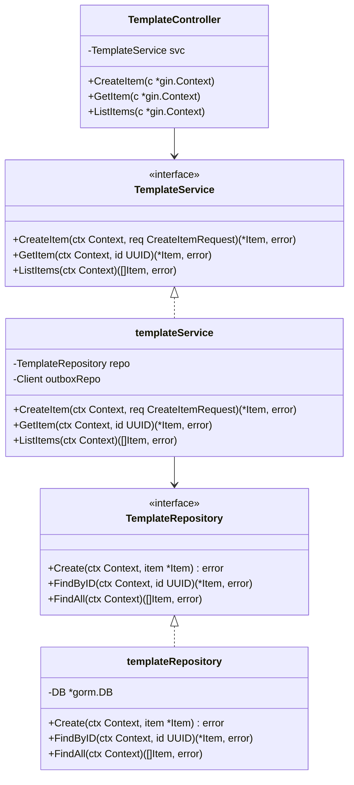

# Class Diagram — Template Service

Berikut adalah diagram kelas standar arsitektur layer Go untuk service backend PMB.

```mermaid
classDiagram
    class TemplateController {
        -TemplateService svc
        +CreateItem(c *gin.Context)
        +GetItem(c *gin.Context)
        +ListItems(c *gin.Context)
    }

    class TemplateService {
        <<interface>>
        +CreateItem(ctx Context, req CreateItemRequest) (*Item, error)
        +GetItem(ctx Context, id UUID) (*Item, error)
        +ListItems(ctx Context) ([]Item, error)
    }

    class templateService {
        -TemplateRepository repo
        -Client outboxRepo
        +CreateItem(ctx Context, req CreateItemRequest) (*Item, error)
        +GetItem(ctx Context, id UUID) (*Item, error)
        +ListItems(ctx Context) ([]Item, error)
    }

    class TemplateRepository {
        <<interface>>
        +Create(ctx Context, item *Item) error
        +FindByID(ctx Context, id UUID) (*Item, error)
        +FindAll(ctx Context) ([]Item, error)
    }

    class templateRepository {
        -DB *gorm.DB
        +Create(ctx Context, item *Item) error
        +FindByID(ctx Context, id UUID) (*Item, error)
        +FindAll(ctx Context) ([]Item, error)
    }

    TemplateController --> TemplateService
    TemplateService <|.. templateService
    templateService --> TemplateRepository
    TemplateRepository <|.. templateRepository
```
