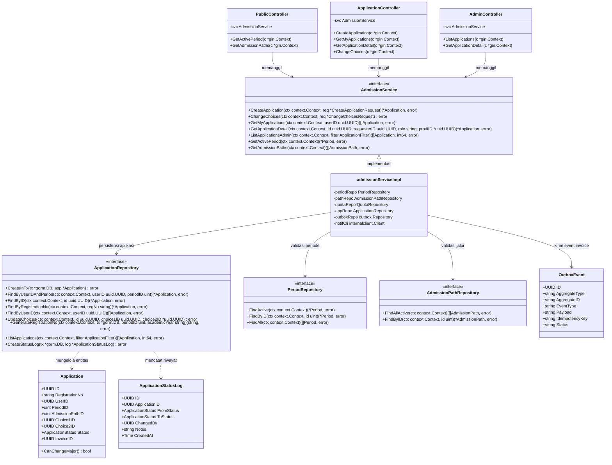

# Class Diagram — Admission Service (Bagian 1)

Dokumen ini memuat arsitektur kelas, antarmuka, dan dependensi untuk **Admission Service** (`services/admission-service`).

```mermaid
classDiagram
    direction TB

    class PublicController {
        -svc AdmissionService
        +GetActivePeriod(c *gin.Context)
        +GetAdmissionPaths(c *gin.Context)
    }

    class ApplicationController {
        -svc AdmissionService
        +CreateApplication(c *gin.Context)
        +GetMyApplications(c *gin.Context)
        +GetApplicationDetail(c *gin.Context)
        +ChangeChoices(c *gin.Context)
    }

    class AdminController {
        -svc AdmissionService
        +ListApplications(c *gin.Context)
        +GetApplicationDetail(c *gin.Context)
    }

    class AdmissionService {
        <<interface>>
        +CreateApplication(ctx context.Context, req *CreateApplicationRequest) (*Application, error)
        +ChangeChoices(ctx context.Context, req *ChangeChoicesRequest) error
        +GetMyApplications(ctx context.Context, userID uuid.UUID) ([]Application, error)
        +GetApplicationDetail(ctx context.Context, id uuid.UUID, requesterID uuid.UUID, role string, prodiID *uuid.UUID) (*Application, error)
        +ListApplicationsAdmin(ctx context.Context, filter ApplicationFilter) ([]Application, int64, error)
        +GetActivePeriod(ctx context.Context) (*Period, error)
        +GetAdmissionPaths(ctx context.Context) ([]AdmissionPath, error)
    }

    class admissionServiceImpl {
        -periodRepo PeriodRepository
        -pathRepo AdmissionPathRepository
        -quotaRepo QuotaRepository
        -appRepo ApplicationRepository
        -outboxRepo outbox.Repository
        -notifCli internalclient.Client
    }

    class ApplicationRepository {
        <<interface>>
        +CreateInTx(tx *gorm.DB, app *Application) error
        +FindByUserIDAndPeriod(ctx context.Context, userID uuid.UUID, periodID uint) (*Application, error)
        +FindByID(ctx context.Context, id uuid.UUID) (*Application, error)
        +FindByRegistrationNo(ctx context.Context, regNo string) (*Application, error)
        +FindByUserID(ctx context.Context, userID uuid.UUID) ([]Application, error)
        +UpdateChoices(ctx context.Context, id uuid.UUID, choice1ID uuid.UUID, choice2ID *uuid.UUID) error
        +GenerateRegistrationNo(ctx context.Context, tx *gorm.DB, periodID uint, academicYear string) (string, error)
        +ListApplications(ctx context.Context, filter ApplicationFilter) ([]Application, int64, error)
        +CreateStatusLog(tx *gorm.DB, log *ApplicationStatusLog) error
    }

    class PeriodRepository {
        <<interface>>
        +FindActive(ctx context.Context) (*Period, error)
        +FindByID(ctx context.Context, id uint) (*Period, error)
        +FindAll(ctx context.Context) ([]Period, error)
    }

    class AdmissionPathRepository {
        <<interface>>
        +FindAllActive(ctx context.Context) ([]AdmissionPath, error)
        +FindByID(ctx context.Context, id uint) (*AdmissionPath, error)
    }

    class Application {
        +UUID ID
        +string RegistrationNo
        +UUID UserID
        +uint PeriodID
        +uint AdmissionPathID
        +UUID Choice1ID
        +UUID Choice2ID
        +ApplicationStatus Status
        +UUID InvoiceID
        +CanChangeMajor() bool
    }

    class ApplicationStatusLog {
        +UUID ID
        +UUID ApplicationID
        +ApplicationStatus FromStatus
        +ApplicationStatus ToStatus
        +UUID ChangedBy
        +string Notes
        +Time CreatedAt
    }

    class OutboxEvent {
        +UUID ID
        +string AggregateType
        +string AggregateID
        +string EventType
        +string Payload
        +string IdempotencyKey
        +string Status
    }

    PublicController --> AdmissionService : memanggil
    ApplicationController --> AdmissionService : memanggil
    AdminController --> AdmissionService : memanggil
    AdmissionService <|.. admissionServiceImpl : implementasi
    admissionServiceImpl --> ApplicationRepository : persistensi aplikasi
    admissionServiceImpl --> PeriodRepository : validasi periode
    admissionServiceImpl --> AdmissionPathRepository : validasi jalur
    admissionServiceImpl --> OutboxEvent : kirim event invoice
    ApplicationRepository ..> Application : mengelola entitas
    ApplicationRepository ..> ApplicationStatusLog : mencatat riwayat
```
