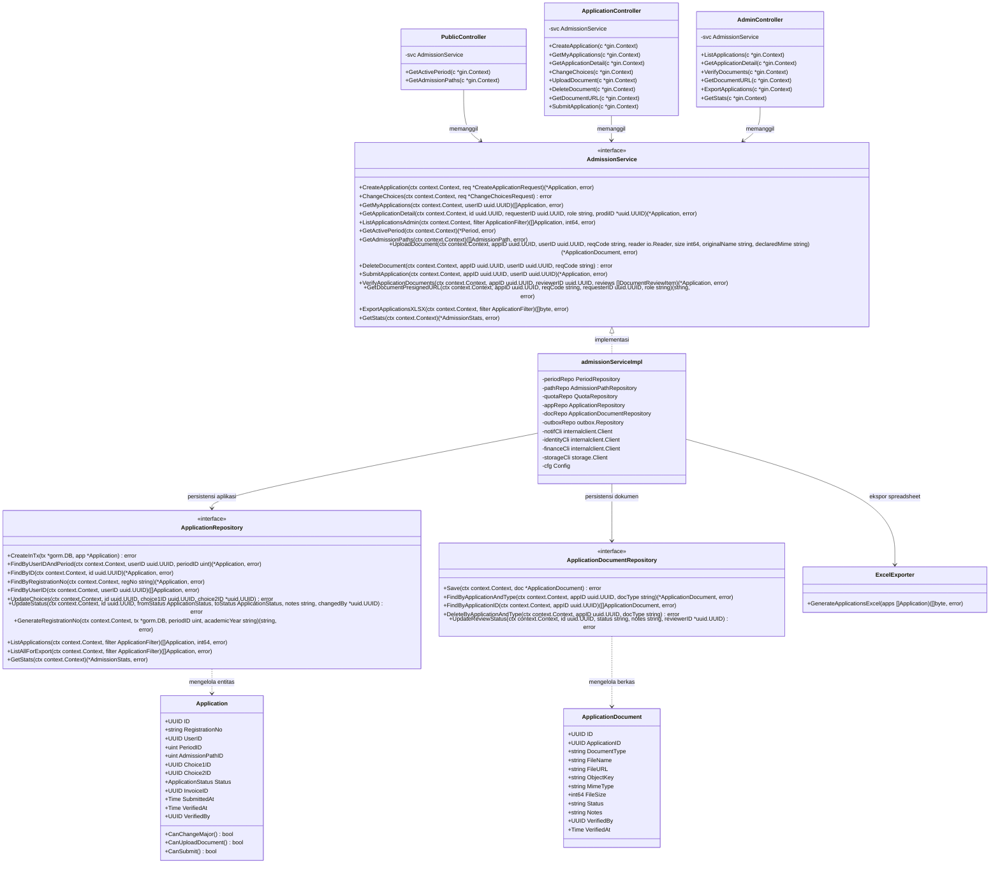

# Class Diagram — Admission Service (Bagian 1 & 2 — F2-M4 & F2-M6)

Dokumen ini memuat arsitektur kelas, antarmuka, dan dependensi untuk **Admission Service** (`services/admission-service`).

```mermaid
classDiagram
    direction TB

    class PublicController {
        -svc AdmissionService
        +GetActivePeriod(c *gin.Context)
        +GetAdmissionPaths(c *gin.Context)
    }

    class ApplicationController {
        -svc AdmissionService
        +CreateApplication(c *gin.Context)
        +GetMyApplications(c *gin.Context)
        +GetApplicationDetail(c *gin.Context)
        +ChangeChoices(c *gin.Context)
        +UploadDocument(c *gin.Context)
        +DeleteDocument(c *gin.Context)
        +GetDocumentURL(c *gin.Context)
        +SubmitApplication(c *gin.Context)
    }

    class AdminController {
        -svc AdmissionService
        +ListApplications(c *gin.Context)
        +GetApplicationDetail(c *gin.Context)
        +VerifyDocuments(c *gin.Context)
        +GetDocumentURL(c *gin.Context)
        +ExportApplications(c *gin.Context)
        +GetStats(c *gin.Context)
    }

    class AdmissionService {
        <<interface>>
        +CreateApplication(ctx context.Context, req *CreateApplicationRequest) (*Application, error)
        +ChangeChoices(ctx context.Context, req *ChangeChoicesRequest) error
        +GetMyApplications(ctx context.Context, userID uuid.UUID) ([]Application, error)
        +GetApplicationDetail(ctx context.Context, id uuid.UUID, requesterID uuid.UUID, role string, prodiID *uuid.UUID) (*Application, error)
        +ListApplicationsAdmin(ctx context.Context, filter ApplicationFilter) ([]Application, int64, error)
        +GetActivePeriod(ctx context.Context) (*Period, error)
        +GetAdmissionPaths(ctx context.Context) ([]AdmissionPath, error)
        +UploadDocument(ctx context.Context, appID uuid.UUID, userID uuid.UUID, reqCode string, reader io.Reader, size int64, originalName string, declaredMime string) (*ApplicationDocument, error)
        +DeleteDocument(ctx context.Context, appID uuid.UUID, userID uuid.UUID, reqCode string) error
        +SubmitApplication(ctx context.Context, appID uuid.UUID, userID uuid.UUID) (*Application, error)
        +VerifyApplicationDocuments(ctx context.Context, appID uuid.UUID, reviewerID uuid.UUID, reviews []DocumentReviewItem) (*Application, error)
        +GetDocumentPresignedURL(ctx context.Context, appID uuid.UUID, reqCode string, requesterID uuid.UUID, role string) (string, error)
        +ExportApplicationsXLSX(ctx context.Context, filter ApplicationFilter) ([]byte, error)
        +GetStats(ctx context.Context) (*AdmissionStats, error)
    }

    class admissionServiceImpl {
        -periodRepo PeriodRepository
        -pathRepo AdmissionPathRepository
        -quotaRepo QuotaRepository
        -appRepo ApplicationRepository
        -docRepo ApplicationDocumentRepository
        -outboxRepo outbox.Repository
        -notifCli internalclient.Client
        -identityCli internalclient.Client
        -financeCli internalclient.Client
        -storageCli storage.Client
        -cfg Config
    }

    class ApplicationRepository {
        <<interface>>
        +CreateInTx(tx *gorm.DB, app *Application) error
        +FindByUserIDAndPeriod(ctx context.Context, userID uuid.UUID, periodID uint) (*Application, error)
        +FindByID(ctx context.Context, id uuid.UUID) (*Application, error)
        +FindByRegistrationNo(ctx context.Context, regNo string) (*Application, error)
        +FindByUserID(ctx context.Context, userID uuid.UUID) ([]Application, error)
        +UpdateChoices(ctx context.Context, id uuid.UUID, choice1ID uuid.UUID, choice2ID *uuid.UUID) error
        +UpdateStatus(ctx context.Context, id uuid.UUID, fromStatus ApplicationStatus, toStatus ApplicationStatus, notes string, changedBy *uuid.UUID) error
        +GenerateRegistrationNo(ctx context.Context, tx *gorm.DB, periodID uint, academicYear string) (string, error)
        +ListApplications(ctx context.Context, filter ApplicationFilter) ([]Application, int64, error)
        +ListAllForExport(ctx context.Context, filter ApplicationFilter) ([]Application, error)
        +GetStats(ctx context.Context) (*AdmissionStats, error)
    }

    class ApplicationDocumentRepository {
        <<interface>>
        +Save(ctx context.Context, doc *ApplicationDocument) error
        +FindByApplicationAndType(ctx context.Context, appID uuid.UUID, docType string) (*ApplicationDocument, error)
        +FindByApplicationID(ctx context.Context, appID uuid.UUID) ([]ApplicationDocument, error)
        +DeleteByApplicationAndType(ctx context.Context, appID uuid.UUID, docType string) error
        +UpdateReviewStatus(ctx context.Context, id uuid.UUID, status string, notes string, reviewerID *uuid.UUID) error
    }

    class ExcelExporter {
        +GenerateApplicationsExcel(apps []Application) ([]byte, error)
    }

    class Application {
        +UUID ID
        +string RegistrationNo
        +UUID UserID
        +uint PeriodID
        +uint AdmissionPathID
        +UUID Choice1ID
        +UUID Choice2ID
        +ApplicationStatus Status
        +UUID InvoiceID
        +Time SubmittedAt
        +Time VerifiedAt
        +UUID VerifiedBy
        +CanChangeMajor() bool
        +CanUploadDocument() bool
        +CanSubmit() bool
    }

    class ApplicationDocument {
        +UUID ID
        +UUID ApplicationID
        +string DocumentType
        +string FileName
        +string FileURL
        +string ObjectKey
        +string MimeType
        +int64 FileSize
        +string Status
        +string Notes
        +UUID VerifiedBy
        +Time VerifiedAt
    }

    PublicController --> AdmissionService : memanggil
    ApplicationController --> AdmissionService : memanggil
    AdminController --> AdmissionService : memanggil
    AdmissionService <|.. admissionServiceImpl : implementasi
    admissionServiceImpl --> ApplicationRepository : persistensi aplikasi
    admissionServiceImpl --> ApplicationDocumentRepository : persistensi dokumen
    admissionServiceImpl --> ExcelExporter : ekspor spreadsheet
    ApplicationRepository ..> Application : mengelola entitas
    ApplicationDocumentRepository ..> ApplicationDocument : mengelola berkas
```
