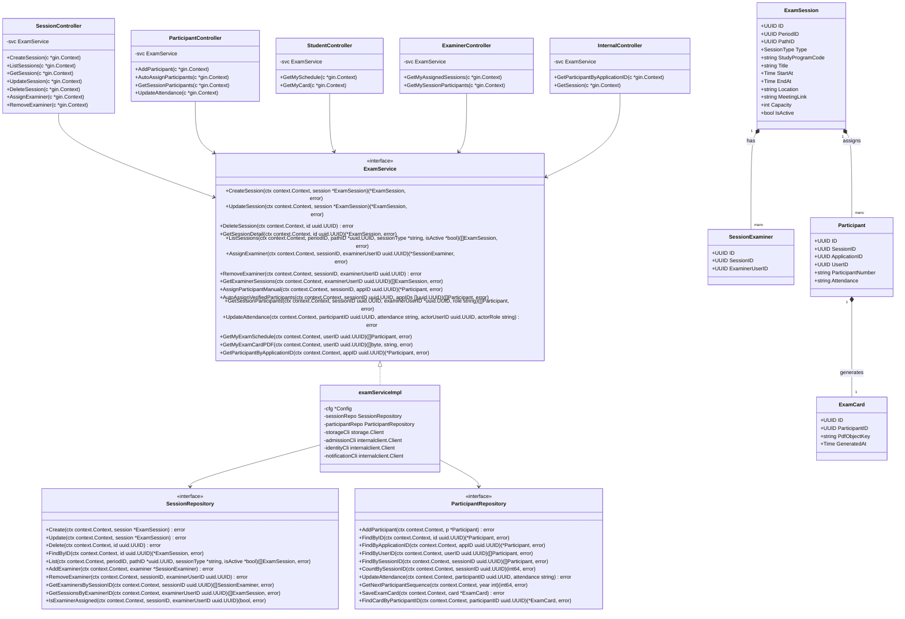

# Class Diagram — Exam Service (F2-M7)

Dokumen ini memuat arsitektur kelas, antarmuka, model, repository, dan controller untuk **Exam Service** (`services/exam-service`).

```mermaid
classDiagram
    direction TB

    class SessionController {
        -svc ExamService
        +CreateSession(c *gin.Context)
        +ListSessions(c *gin.Context)
        +GetSession(c *gin.Context)
        +UpdateSession(c *gin.Context)
        +DeleteSession(c *gin.Context)
        +AssignExaminer(c *gin.Context)
        +RemoveExaminer(c *gin.Context)
    }

    class ParticipantController {
        -svc ExamService
        +AddParticipant(c *gin.Context)
        +AutoAssignParticipants(c *gin.Context)
        +GetSessionParticipants(c *gin.Context)
        +UpdateAttendance(c *gin.Context)
    }

    class StudentController {
        -svc ExamService
        +GetMySchedule(c *gin.Context)
        +GetMyCard(c *gin.Context)
    }

    class ExaminerController {
        -svc ExamService
        +GetMyAssignedSessions(c *gin.Context)
        +GetMySessionParticipants(c *gin.Context)
    }

    class InternalController {
        -svc ExamService
        +GetParticipantByApplicationID(c *gin.Context)
        +GetSession(c *gin.Context)
    }

    class ExamService {
        <<interface>>
        +CreateSession(ctx context.Context, session *ExamSession) (*ExamSession, error)
        +UpdateSession(ctx context.Context, session *ExamSession) (*ExamSession, error)
        +DeleteSession(ctx context.Context, id uuid.UUID) error
        +GetSessionDetail(ctx context.Context, id uuid.UUID) (*ExamSession, error)
        +ListSessions(ctx context.Context, periodID, pathID *uuid.UUID, sessionType *string, isActive *bool) ([]ExamSession, error)
        +AssignExaminer(ctx context.Context, sessionID, examinerUserID uuid.UUID) (*SessionExaminer, error)
        +RemoveExaminer(ctx context.Context, sessionID, examinerUserID uuid.UUID) error
        +GetExaminerSessions(ctx context.Context, examinerUserID uuid.UUID) ([]ExamSession, error)
        +AssignParticipantManual(ctx context.Context, sessionID, appID uuid.UUID) (*Participant, error)
        +AutoAssignVerifiedParticipants(ctx context.Context, sessionID uuid.UUID, appIDs []uuid.UUID) ([]Participant, error)
        +GetSessionParticipants(ctx context.Context, sessionID uuid.UUID, examinerUserID *uuid.UUID, role string) ([]Participant, error)
        +UpdateAttendance(ctx context.Context, participantID uuid.UUID, attendance string, actorUserID uuid.UUID, actorRole string) error
        +GetMyExamSchedule(ctx context.Context, userID uuid.UUID) ([]Participant, error)
        +GetMyExamCardPDF(ctx context.Context, userID uuid.UUID) ([]byte, string, error)
        +GetParticipantByApplicationID(ctx context.Context, appID uuid.UUID) (*Participant, error)
    }

    class examServiceImpl {
        -cfg *Config
        -sessionRepo SessionRepository
        -participantRepo ParticipantRepository
        -storageCli storage.Client
        -admissionCli internalclient.Client
        -identityCli internalclient.Client
        -notificationCli internalclient.Client
    }

    class SessionRepository {
        <<interface>>
        +Create(ctx context.Context, session *ExamSession) error
        +Update(ctx context.Context, session *ExamSession) error
        +Delete(ctx context.Context, id uuid.UUID) error
        +FindByID(ctx context.Context, id uuid.UUID) (*ExamSession, error)
        +List(ctx context.Context, periodID, pathID *uuid.UUID, sessionType *string, isActive *bool) ([]ExamSession, error)
        +AddExaminer(ctx context.Context, examiner *SessionExaminer) error
        +RemoveExaminer(ctx context.Context, sessionID, examinerUserID uuid.UUID) error
        +GetExaminersBySessionID(ctx context.Context, sessionID uuid.UUID) ([]SessionExaminer, error)
        +GetSessionsByExaminerID(ctx context.Context, examinerUserID uuid.UUID) ([]ExamSession, error)
        +IsExaminerAssigned(ctx context.Context, sessionID, examinerUserID uuid.UUID) (bool, error)
    }

    class ParticipantRepository {
        <<interface>>
        +AddParticipant(ctx context.Context, p *Participant) error
        +FindByID(ctx context.Context, id uuid.UUID) (*Participant, error)
        +FindByApplicationID(ctx context.Context, appID uuid.UUID) (*Participant, error)
        +FindByUserID(ctx context.Context, userID uuid.UUID) ([]Participant, error)
        +FindBySessionID(ctx context.Context, sessionID uuid.UUID) ([]Participant, error)
        +CountBySessionID(ctx context.Context, sessionID uuid.UUID) (int64, error)
        +UpdateAttendance(ctx context.Context, participantID uuid.UUID, attendance string) error
        +GetNextParticipantSequence(ctx context.Context, year int) (int64, error)
        +SaveExamCard(ctx context.Context, card *ExamCard) error
        +FindCardByParticipantID(ctx context.Context, participantID uuid.UUID) (*ExamCard, error)
    }

    class ExamSession {
        +UUID ID
        +UUID PeriodID
        +UUID PathID
        +SessionType Type
        +string StudyProgramCode
        +string Title
        +Time StartAt
        +Time EndAt
        +string Location
        +string MeetingLink
        +int Capacity
        +bool IsActive
    }

    class SessionExaminer {
        +UUID ID
        +UUID SessionID
        +UUID ExaminerUserID
    }

    class Participant {
        +UUID ID
        +UUID SessionID
        +UUID ApplicationID
        +UUID UserID
        +string ParticipantNumber
        +string Attendance
    }

    class ExamCard {
        +UUID ID
        +UUID ParticipantID
        +string PdfObjectKey
        +Time GeneratedAt
    }

    SessionController --> ExamService
    ParticipantController --> ExamService
    StudentController --> ExamService
    ExaminerController --> ExamService
    InternalController --> ExamService

    ExamService <|.. examServiceImpl
    examServiceImpl --> SessionRepository
    examServiceImpl --> ParticipantRepository

    ExamSession "1" *-- "many" SessionExaminer : has
    ExamSession "1" *-- "many" Participant : assigns
    Participant "1" *-- "1" ExamCard : generates
```
