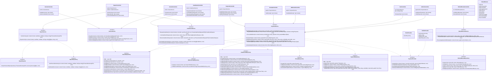

# Class Diagram — Finance Service (Bagian 1 & 2: F2-M5 & F2-M10)

Dokumen ini memuat diagram kelas dan dependensi antarmuka untuk **Finance Service** (`services/finance-service`).

```mermaid
classDiagram
    direction TB

    class InvoiceController {
        -invSvc InvoiceService
        +GetMyInvoices(c *gin.Context)
        +GetInvoiceDetail(c *gin.Context)
    }

    class PaymentController {
        -paySvc PaymentService
        +PayWithVirtualAccount(c *gin.Context)
        +PayWithManualTransfer(c *gin.Context)
        +GetPaymentDetail(c *gin.Context)
    }

    class InstallmentController {
        -instSvc InstallmentService
        +RequestInstallment(c *gin.Context)
        +ListInstallmentRequests(c *gin.Context)
        +ReviewInstallmentRequest(c *gin.Context)
        +GetInstallmentSchedule(c *gin.Context)
    }

    class ReportController {
        -repSvc ReportService
        -instSvc InstallmentService
        +GetSummary(c *gin.Context)
        +ExportXLSX(c *gin.Context)
        +ProcessDueDatesCron(c *gin.Context)
    }

    class ReceiptController {
        -paySvc PaymentService
        +GetReceipt(c *gin.Context)
    }

    class WebhookController {
        -paySvc PaymentService
        +HandleWebhook(c *gin.Context)
    }

    class DevController {
        -svc PaymentService
        -cfg *config.Config
        +SimulatePaid(c *gin.Context)
    }

    class AdminController {
        -paymentSvc PaymentService
        +ListManualTransfers(c *gin.Context)
        +VerifyPayment(c *gin.Context)
    }

    class InternalController {
        -invSvc InvoiceService
        +CreateInvoice(c *gin.Context)
        +GetInvoices(c *gin.Context)
    }

    class InvoiceService {
        <<interface>>
        +CreateInvoice(ctx context.Context, req *CreateInvoiceRequest) (*Invoice, error)
        +GetMyInvoices(ctx context.Context, userID uuid.UUID) ([]Invoice, error)
        +GetInvoiceDetail(ctx context.Context, id uuid.UUID, requesterID uuid.UUID, role string) (*Invoice, error)
        +GetInvoiceByApplicationID(ctx context.Context, appID uuid.UUID) (*Invoice, error)
    }

    class PaymentService {
        <<interface>>
        +PayWithVirtualAccount(ctx context.Context, invoiceID, userID uuid.UUID) (*Payment, error)
        +PayWithManualTransfer(ctx context.Context, invoiceID, userID uuid.UUID, proofBytes []byte, fileName string) (*Payment, error)
        +ProcessWebhook(ctx context.Context, providerName string, signature string, payloadBytes []byte) error
        +SimulatePaid(ctx context.Context, paymentID uuid.UUID) (*Payment, error)
        +VerifyManualTransfer(ctx context.Context, paymentID uuid.UUID, action, notes string, verifiedBy uuid.UUID) error
        +GetPaymentByID(ctx context.Context, id uuid.UUID, requesterID uuid.UUID, role string) (*Payment, error)
        +GetReceiptByPaymentID(ctx context.Context, paymentID uuid.UUID, requesterID uuid.UUID, role string) (*Receipt, []byte, error)
        +ListAwaitingVerification(ctx context.Context, limit, offset int) ([]Payment, int64, error)
    }

    class InstallmentService {
        <<interface>>
        +RequestInstallment(ctx context.Context, invoiceID, userID uuid.UUID, req *CreateInstallmentRequestDTO) (*InstallmentRequest, error)
        +ListInstallmentRequests(ctx context.Context, status string, limit, offset int) ([]InstallmentRequest, int64, error)
        +ReviewInstallmentRequest(ctx context.Context, reqID, reviewerID uuid.UUID, req *ReviewInstallmentRequestDTO) (*InstallmentRequest, error)
        +GetInstallmentSchedule(ctx context.Context, invoiceID, userID uuid.UUID, role string) ([]Installment, error)
        +ProcessDueDatesAndReminders(ctx context.Context) (int, int, error)
    }

    class ReportService {
        <<interface>>
        +GetSummary(ctx context.Context, startDate, endDate, feeType string) (*FinancialSummaryDTO, error)
        +ExportXLSX(ctx context.Context, startDate, endDate, feeType string) ([]byte, string, error)
    }

    class ReportExporter {
        <<interface>>
        +ExportFinancialReport(summary *FinancialSummaryDTO, invoices []Invoice) ([]byte, error)
    }

    class RefundReviewController {
        -svc RefundReviewService
        +ListRefundReviews(c *gin.Context)
        +ReviewRefund(c *gin.Context)
    }

    class PaymentProvider {
        <<interface>>
        +CreateVA(ctx context.Context, invoiceID uuid.UUID, amount int64) (*VAResult, error)
        +VerifyWebhookSignature(signature string, payload []byte) bool
        +ParseWebhookPayload(payload []byte) (*WebhookPayload, error)
        +GetPaymentMethods(ctx context.Context, amount int64) ([]PaymentMethodItem, error)
    }

    class MockProvider {
        -secretKey string
    }

    class DuitkuProvider {
        -merchantCode string
        -apiKey string
        -popBaseURL string
        -webAPIBaseURL string
    }

    class RefundReviewService {
        <<interface>>
        +ListRefundReviews(ctx context.Context, status string, page, limit int) ([]RefundReview, int64, error)
        +ReviewRefund(ctx context.Context, id, reviewerID uuid.UUID, req *ReviewRefundRequest) (*RefundReview, error)
        +ProcessApplicationWithdrawal(ctx context.Context, appID uuid.UUID) (int, error)
    }

    class InvoiceRepository {
        <<interface>>
        +DB() *gorm.DB
        +Create(ctx context.Context, inv *Invoice) error
        +CreateInTx(tx *gorm.DB, inv *Invoice) error
        +FindByID(ctx context.Context, id uuid.UUID) (*Invoice, error)
        +FindByUserID(ctx context.Context, userID uuid.UUID) ([]Invoice, error)
        +FindByApplicationID(ctx context.Context, appID uuid.UUID) (*Invoice, error)
        +FindByInvoiceNumber(ctx context.Context, invoiceNumber string) (*Invoice, error)
        +GenerateInvoiceNumber(ctx context.Context, tx *gorm.DB) (string, error)
        +UpdateStatus(ctx context.Context, id uuid.UUID, status InvoiceStatus, paidAmount int64) error
        +UpdateStatusInTx(tx *gorm.DB, id uuid.UUID, status InvoiceStatus, paidAmount int64) error
    }

    class PaymentRepository {
        <<interface>>
        +DB() *gorm.DB
        +CreateInTx(tx *gorm.DB, payment *Payment) error
        +FindByID(ctx context.Context, id uuid.UUID) (*Payment, error)
        +FindByProviderRef(ctx context.Context, providerRef string) (*Payment, error)
        +ListAwaitingVerification(ctx context.Context, limit, offset int) ([]Payment, int64, error)
        +UpdateStatusInTx(tx *gorm.DB, paymentID uuid.UUID, status PaymentStatus, notes string, verifiedBy *uuid.UUID, paidAt *time.Time) error
    }

    class InstallmentRepository {
        <<interface>>
        +DB() *gorm.DB
        +CreateRequest(ctx context.Context, req *InstallmentRequest) error
        +FindRequestByID(ctx context.Context, id uuid.UUID) (*InstallmentRequest, error)
        +FindRequestByInvoiceID(ctx context.Context, invoiceID uuid.UUID) (*InstallmentRequest, error)
        +ListRequests(ctx context.Context, status string, limit, offset int) ([]InstallmentRequest, int64, error)
        +UpdateRequestInTx(tx *gorm.DB, req *InstallmentRequest) error
        +CreateInstallmentsInTx(tx *gorm.DB, items []Installment) error
        +FindInstallmentsByInvoiceID(ctx context.Context, invoiceID uuid.UUID) ([]Installment, error)
        +FindInstallmentByID(ctx context.Context, id uuid.UUID) (*Installment, error)
        +FindNextUnpaidInstallment(ctx context.Context, invoiceID uuid.UUID) (*Installment, error)
        +UpdateInstallmentStatusInTx(tx *gorm.DB, id uuid.UUID, status InstallmentStatus, paidAt *time.Time) error
        +FindExpiringInstallments(ctx context.Context, targetDate time.Time) ([]Installment, error)
        +MarkExpiredInstallments(ctx context.Context, now time.Time) (int64, error)
    }

    class ReportRepository {
        <<interface>>
        +GetFinancialSummary(ctx context.Context, startDate, endDate, feeType string) (*FinancialSummaryDTO, error)
        +GetDetailedInvoices(ctx context.Context, startDate, endDate, feeType string) ([]Invoice, error)
    }

    class ReceiptRepository {
        <<interface>>
        +CreateInTx(tx *gorm.DB, receipt *Receipt) error
        +FindByPaymentID(ctx context.Context, paymentID uuid.UUID) (*Receipt, error)
        +FindByReceiptNumber(ctx context.Context, receiptNo string) (*Receipt, error)
        +GenerateReceiptNumber(ctx context.Context, tx *gorm.DB) (string, error)
    }

    class WebhookLogRepository {
        <<interface>>
        +Create(ctx context.Context, log *PaymentWebhookLog) error
        +FindByProviderRef(ctx context.Context, providerRef string) (*PaymentWebhookLog, error)
    }

    class RefundReviewRepository {
        <<interface>>
        +CreateInTx(tx *gorm.DB, review *RefundReview) error
        +FindByID(ctx context.Context, id uuid.UUID) (*RefundReview, error)
        +List(ctx context.Context, status string, page, limit int) ([]RefundReview, int64, error)
        +UpdateInTx(tx *gorm.DB, review *RefundReview) error
        +FindByPaymentID(ctx context.Context, paymentID uuid.UUID) (*RefundReview, error)
    }

    class RefundReview {
        +UUID ID
        +UUID PaymentID
        +UUID InvoiceID
        +UUID ApplicationID
        +int64 Amount
        +string Status
        +string Notes
        +UUID ReviewedBy
        +Time ReviewedAt
        +Time CreatedAt
    }

    InvoiceController --> InvoiceService
    PaymentController --> PaymentService
    InstallmentController --> InstallmentService
    ReportController --> ReportService
    ReportController --> InstallmentService
    ReceiptController --> PaymentService
    WebhookController --> PaymentService
    DevController --> PaymentService
    AdminController --> PaymentService
    InternalController --> InvoiceService
    RefundReviewController --> RefundReviewService

    PaymentService ..> PaymentProvider
    MockProvider ..|> PaymentProvider
    DuitkuProvider ..|> PaymentProvider

    InvoiceService ..> InvoiceRepository
    PaymentService ..> PaymentRepository
    PaymentService ..> InvoiceRepository
    PaymentService ..> InstallmentRepository
    PaymentService ..> ReceiptRepository
    PaymentService ..> WebhookLogRepository
    RefundReviewService ..> RefundReviewRepository

    InstallmentService ..> InstallmentRepository
    InstallmentService ..> InvoiceRepository
    ReportService ..> ReportRepository
    ReportService ..> ReportExporter
```

