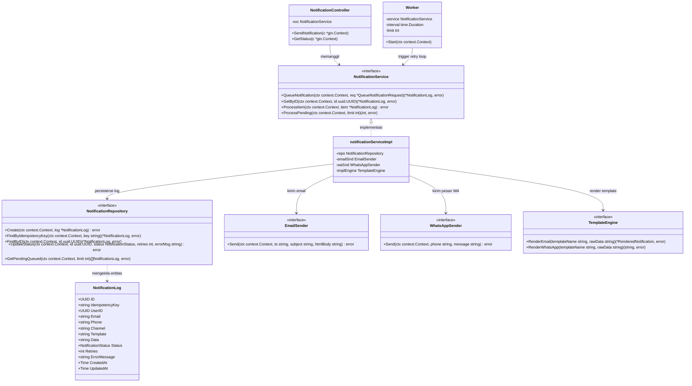

# Class Diagram — Notification Service

Dokumen ini memuat arsitektur kelas, antarmuka, dan dependensi untuk **Notification Service** (`services/notification-service`).

```mermaid
classDiagram
    direction TB

    class NotificationController {
        -svc NotificationService
        +SendNotification(c *gin.Context)
        +GetStatus(c *gin.Context)
    }

    class NotificationService {
        <<interface>>
        +QueueNotification(ctx context.Context, req *QueueNotificationRequest) (*NotificationLog, error)
        +GetByID(ctx context.Context, id uuid.UUID) (*NotificationLog, error)
        +ProcessItem(ctx context.Context, item *NotificationLog) error
        +ProcessPending(ctx context.Context, limit int) (int, error)
    }

    class notificationServiceImpl {
        -repo NotificationRepository
        -emailSnd EmailSender
        -waSnd WhatsAppSender
        -tmplEngine TemplateEngine
    }

    class NotificationRepository {
        <<interface>>
        +Create(ctx context.Context, log *NotificationLog) error
        +FindByIdempotencyKey(ctx context.Context, key string) (*NotificationLog, error)
        +FindByID(ctx context.Context, id uuid.UUID) (*NotificationLog, error)
        +UpdateStatus(ctx context.Context, id uuid.UUID, status NotificationStatus, retries int, errorMsg string) error
        +GetPendingQueued(ctx context.Context, limit int) ([]NotificationLog, error)
    }

    class EmailSender {
        <<interface>>
        +Send(ctx context.Context, to string, subject string, htmlBody string) error
    }

    class WhatsAppSender {
        <<interface>>
        +Send(ctx context.Context, phone string, message string) error
    }

    class TemplateEngine {
        <<interface>>
        +RenderEmail(templateName string, rawData string) (*RenderedNotification, error)
        +RenderWhatsApp(templateName string, rawData string) (string, error)
    }

    class Worker {
        -service NotificationService
        -interval time.Duration
        -limit int
        +Start(ctx context.Context)
    }

    class NotificationLog {
        +UUID ID
        +string IdempotencyKey
        +UUID UserID
        +string Email
        +string Phone
        +string Channel
        +string Template
        +string Data
        +NotificationStatus Status
        +int Retries
        +string ErrorMessage
        +Time CreatedAt
        +Time UpdatedAt
    }

    NotificationController --> NotificationService : memanggil
    NotificationService <|.. notificationServiceImpl : implementasi
    notificationServiceImpl --> NotificationRepository : persistensi log
    notificationServiceImpl --> EmailSender : kirim email
    notificationServiceImpl --> WhatsAppSender : kirim pesan WA
    notificationServiceImpl --> TemplateEngine : render template
    Worker --> NotificationService : trigger retry loop
    NotificationRepository ..> NotificationLog : mengelola entitas
```
