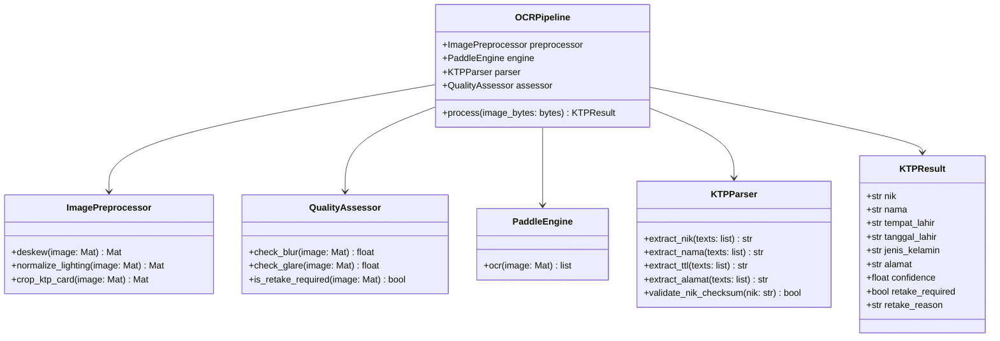

# Class & Pipeline Diagram — OCR Service

Berikut adalah diagram arsitektur kelas dan pipeline pemrosesan OCR KTP pada OCR Service (Python FastAPI).

```mermaid
classDiagram
    class OCRPipeline {
        +ImagePreprocessor preprocessor
        +PaddleEngine engine
        +KTPParser parser
        +QualityAssessor assessor
        +process(image_bytes: bytes) KTPResult
    }

    class ImagePreprocessor {
        +deskew(image: Mat) Mat
        +normalize_lighting(image: Mat) Mat
        +crop_ktp_card(image: Mat) Mat
    }

    class QualityAssessor {
        +check_blur(image: Mat) float
        +check_glare(image: Mat) float
        +is_retake_required(image: Mat) bool
    }

    class PaddleEngine {
        +ocr(image: Mat) list
    }

    class KTPParser {
        +extract_nik(texts: list) str
        +extract_nama(texts: list) str
        +extract_ttl(texts: list) str
        +extract_alamat(texts: list) str
        +validate_nik_checksum(nik: str) bool
    }

    class KTPResult {
        +str nik
        +str nama
        +str tempat_lahir
        +str tanggal_lahir
        +str jenis_kelamin
        +str alamat
        +float confidence
        +bool retake_required
        +str retake_reason
    }

    OCRPipeline --> ImagePreprocessor
    OCRPipeline --> QualityAssessor
    OCRPipeline --> PaddleEngine
    OCRPipeline --> KTPParser
    OCRPipeline --> KTPResult
```
