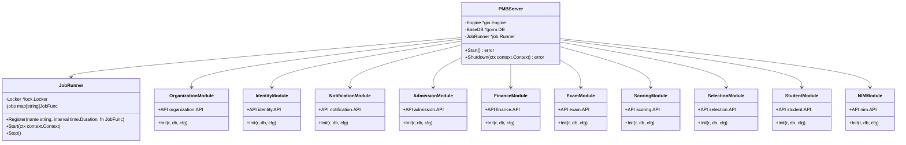

# Class Diagram: PMB Service (Modular Monolith - CR-011)

Diagram struktur modul dan relasi antarmuka dalam layanan monolitik modular `pmb-service`.

```mermaid
classDiagram
    class PMBServer {
        -Engine *gin.Engine
        -BaseDB *gorm.DB
        -JobRunner *job.Runner
        +Start() error
        +Shutdown(ctx context.Context) error
    }

    class JobRunner {
        -Locker *lock.Locker
        -jobs map[string]JobFunc
        +Register(name string, interval time.Duration, fn JobFunc)
        +Start(ctx context.Context)
        +Stop()
    }

    class OrganizationModule {
        +Init(r, db, cfg)
        +API organization.API
    }

    class IdentityModule {
        +Init(r, db, cfg)
        +API identity.API
    }

    class NotificationModule {
        +Init(r, db, cfg)
        +API notification.API
    }

    class AdmissionModule {
        +Init(r, db, cfg)
        +API admission.API
    }

    class FinanceModule {
        +Init(r, db, cfg)
        +API finance.API
    }

    class ExamModule {
        +Init(r, db, cfg)
        +API exam.API
    }

    class ScoringModule {
        +Init(r, db, cfg)
        +API scoring.API
    }

    class SelectionModule {
        +Init(r, db, cfg)
        +API selection.API
    }

    class StudentModule {
        +Init(r, db, cfg)
        +API student.API
    }

    class NIMModule {
        +Init(r, db, cfg)
        +API nim.API
    }

    PMBServer --> JobRunner
    PMBServer --> OrganizationModule
    PMBServer --> IdentityModule
    PMBServer --> NotificationModule
    PMBServer --> AdmissionModule
    PMBServer --> FinanceModule
    PMBServer --> ExamModule
    PMBServer --> ScoringModule
    PMBServer --> SelectionModule
    PMBServer --> StudentModule
    PMBServer --> NIMModule
```
