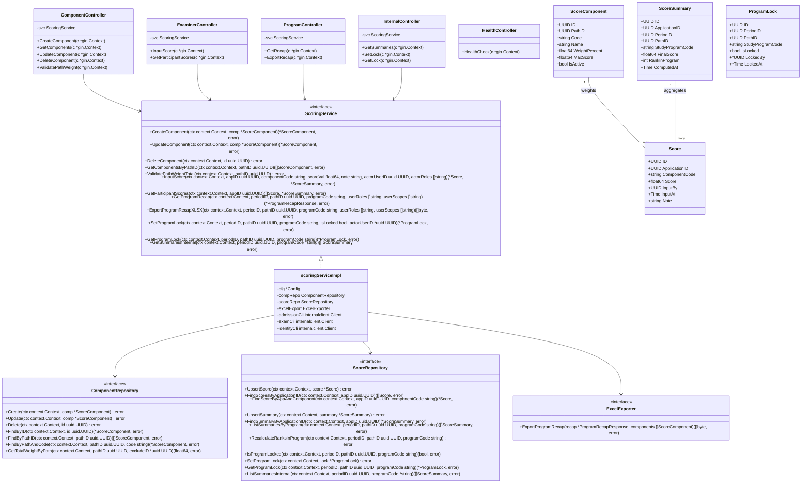

# Class Diagram — Scoring Service (F2-M8)

Dokumen ini memuat arsitektur kelas, antarmuka, model, repository, exporter, dan controller untuk **Scoring Service** (`services/scoring-service`).

```mermaid
classDiagram
    direction TB

    class ComponentController {
        -svc ScoringService
        +CreateComponent(c *gin.Context)
        +GetComponents(c *gin.Context)
        +UpdateComponent(c *gin.Context)
        +DeleteComponent(c *gin.Context)
        +ValidatePathWeight(c *gin.Context)
    }

    class ExaminerController {
        -svc ScoringService
        +InputScore(c *gin.Context)
        +GetParticipantScores(c *gin.Context)
    }

    class ProgramController {
        -svc ScoringService
        +GetRecap(c *gin.Context)
        +ExportRecap(c *gin.Context)
    }

    class InternalController {
        -svc ScoringService
        +GetSummaries(c *gin.Context)
        +SetLock(c *gin.Context)
        +GetLock(c *gin.Context)
    }

    class HealthController {
        +HealthCheck(c *gin.Context)
    }

    class ScoringService {
        <<interface>>
        +CreateComponent(ctx context.Context, comp *ScoreComponent) (*ScoreComponent, error)
        +UpdateComponent(ctx context.Context, comp *ScoreComponent) (*ScoreComponent, error)
        +DeleteComponent(ctx context.Context, id uuid.UUID) error
        +GetComponentsByPathID(ctx context.Context, pathID uuid.UUID) ([]ScoreComponent, error)
        +ValidatePathWeightTotal(ctx context.Context, pathID uuid.UUID) error
        +InputScore(ctx context.Context, appID uuid.UUID, componentCode string, scoreVal float64, note string, actorUserID uuid.UUID, actorRoles []string) (*Score, *ScoreSummary, error)
        +GetParticipantScores(ctx context.Context, appID uuid.UUID) ([]Score, *ScoreSummary, error)
        +GetProgramRecap(ctx context.Context, periodID, pathID uuid.UUID, programCode string, userRoles []string, userScopes []string) (*ProgramRecapResponse, error)
        +ExportProgramRecapXLSX(ctx context.Context, periodID, pathID uuid.UUID, programCode string, userRoles []string, userScopes []string) ([]byte, error)
        +SetProgramLock(ctx context.Context, periodID, pathID uuid.UUID, programCode string, isLocked bool, actorUserID *uuid.UUID) (*ProgramLock, error)
        +GetProgramLock(ctx context.Context, periodID, pathID uuid.UUID, programCode string) (*ProgramLock, error)
        +GetSummariesInternal(ctx context.Context, periodID uuid.UUID, programCode *string) ([]ScoreSummary, error)
    }

    class scoringServiceImpl {
        -cfg *Config
        -compRepo ComponentRepository
        -scoreRepo ScoreRepository
        -excelExport ExcelExporter
        -admissionCli internalclient.Client
        -examCli internalclient.Client
        -identityCli internalclient.Client
    }

    class ComponentRepository {
        <<interface>>
        +Create(ctx context.Context, comp *ScoreComponent) error
        +Update(ctx context.Context, comp *ScoreComponent) error
        +Delete(ctx context.Context, id uuid.UUID) error
        +FindByID(ctx context.Context, id uuid.UUID) (*ScoreComponent, error)
        +FindByPathID(ctx context.Context, pathID uuid.UUID) ([]ScoreComponent, error)
        +FindByPathAndCode(ctx context.Context, pathID uuid.UUID, code string) (*ScoreComponent, error)
        +GetTotalWeightByPath(ctx context.Context, pathID uuid.UUID, excludeID *uuid.UUID) (float64, error)
    }

    class ScoreRepository {
        <<interface>>
        +UpsertScore(ctx context.Context, score *Score) error
        +FindScoresByApplicationID(ctx context.Context, appID uuid.UUID) ([]Score, error)
        +FindScoreByAppAndComponent(ctx context.Context, appID uuid.UUID, componentCode string) (*Score, error)
        +UpsertSummary(ctx context.Context, summary *ScoreSummary) error
        +FindSummaryByApplicationID(ctx context.Context, appID uuid.UUID) (*ScoreSummary, error)
        +ListSummariesByProgram(ctx context.Context, periodID, pathID uuid.UUID, programCode string) ([]ScoreSummary, error)
        +RecalculateRanksInProgram(ctx context.Context, periodID, pathID uuid.UUID, programCode string) error
        +IsProgramLocked(ctx context.Context, periodID, pathID uuid.UUID, programCode string) (bool, error)
        +SetProgramLock(ctx context.Context, lock *ProgramLock) error
        +GetProgramLock(ctx context.Context, periodID, pathID uuid.UUID, programCode string) (*ProgramLock, error)
        +ListSummariesInternal(ctx context.Context, periodID uuid.UUID, programCode *string) ([]ScoreSummary, error)
    }

    class ExcelExporter {
        <<interface>>
        +ExportProgramRecap(recap *ProgramRecapResponse, components []ScoreComponent) ([]byte, error)
    }

    class ScoreComponent {
        +UUID ID
        +UUID PathID
        +string Code
        +string Name
        +float64 WeightPercent
        +float64 MaxScore
        +bool IsActive
    }

    class Score {
        +UUID ID
        +UUID ApplicationID
        +string ComponentCode
        +float64 Score
        +UUID InputBy
        +Time InputAt
        +string Note
    }

    class ScoreSummary {
        +UUID ID
        +UUID ApplicationID
        +UUID PeriodID
        +UUID PathID
        +string StudyProgramCode
        +float64 FinalScore
        +int RankInProgram
        +Time ComputedAt
    }

    class ProgramLock {
        +UUID ID
        +UUID PeriodID
        +UUID PathID
        +string StudyProgramCode
        +bool IsLocked
        +*UUID LockedBy
        +*Time LockedAt
    }

    ComponentController --> ScoringService
    ExaminerController --> ScoringService
    ProgramController --> ScoringService
    InternalController --> ScoringService

    ScoringService <|.. scoringServiceImpl
    scoringServiceImpl --> ComponentRepository
    scoringServiceImpl --> ScoreRepository
    scoringServiceImpl --> ExcelExporter

    ScoreComponent "1" -- "many" Score : weights
    ScoreSummary "1" -- "many" Score : aggregates
```
