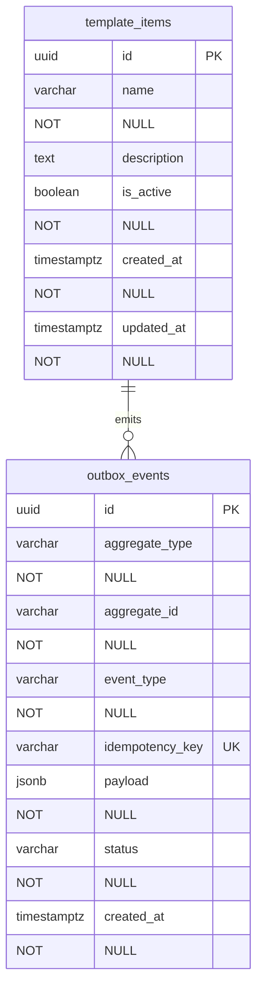

# ERD — Template Service

Berikut adalah Entity Relationship Diagram (ERD) standar basis data untuk template service baru PMB.

```mermaid
erDiagram
    template_items {
        uuid id PK
        varchar name NOT NULL
        text description
        boolean is_active NOT NULL
        timestamptz created_at NOT NULL
        timestamptz updated_at NOT NULL
    }

    outbox_events {
        uuid id PK
        varchar aggregate_type NOT NULL
        varchar aggregate_id NOT NULL
        varchar event_type NOT NULL
        varchar idempotency_key UK
        jsonb payload NOT NULL
        varchar status NOT NULL
        timestamptz created_at NOT NULL
    }

    template_items ||--o{ outbox_events : "emits"
```
