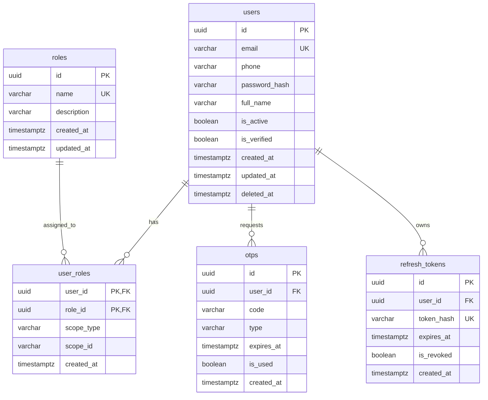

# ERD — Auth Service

Berikut adalah Entity Relationship Diagram (ERD) basis data `pmb_auth` pada Auth Service.

```mermaid
erDiagram
    users {
        uuid id PK
        varchar email UK
        varchar phone
        varchar password_hash
        varchar full_name
        boolean is_active
        boolean is_verified
        timestamptz created_at
        timestamptz updated_at
        timestamptz deleted_at
    }

    roles {
        uuid id PK
        varchar name UK
        varchar description
        timestamptz created_at
        timestamptz updated_at
    }

    user_roles {
        uuid user_id PK, FK
        uuid role_id PK, FK
        varchar scope_type
        varchar scope_id
        timestamptz created_at
    }

    otps {
        uuid id PK
        uuid user_id FK
        varchar code
        varchar type
        timestamptz expires_at
        boolean is_used
        timestamptz created_at
    }

    refresh_tokens {
        uuid id PK
        uuid user_id FK
        varchar token_hash UK
        timestamptz expires_at
        boolean is_revoked
        timestamptz created_at
    }

    users ||--o{ user_roles : "has"
    roles ||--o{ user_roles : "assigned_to"
    users ||--o{ otps : "requests"
    users ||--o{ refresh_tokens : "owns"
```
