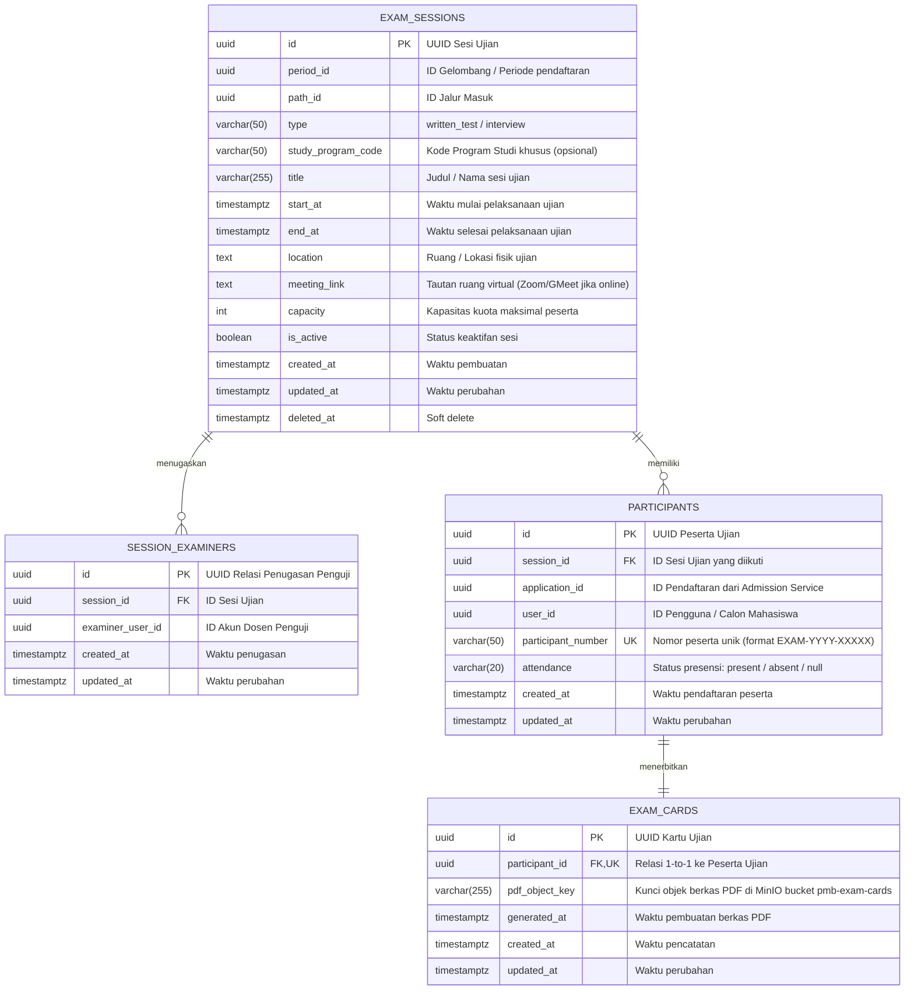

# Entity Relationship Diagram (ERD) — Exam Service

Dokumen ini memetakan relasi tabel-tabel pada basis data `pmb_exam`.

```mermaid
erDiagram
    EXAM_SESSIONS ||--o{ SESSION_EXAMINERS : "menugaskan"
    EXAM_SESSIONS ||--o{ PARTICIPANTS : "memiliki"
    PARTICIPANTS ||--|| EXAM_CARDS : "menerbitkan"

    EXAM_SESSIONS {
        uuid id PK "UUID Sesi Ujian"
        uuid period_id "ID Gelombang / Periode pendaftaran"
        uuid path_id "ID Jalur Masuk"
        varchar(50) type "written_test / interview"
        varchar(50) study_program_code "Kode Program Studi khusus (opsional)"
        varchar(255) title "Judul / Nama sesi ujian"
        timestamptz start_at "Waktu mulai pelaksanaan ujian"
        timestamptz end_at "Waktu selesai pelaksanaan ujian"
        text location "Ruang / Lokasi fisik ujian"
        text meeting_link "Tautan ruang virtual (Zoom/GMeet jika online)"
        int capacity "Kapasitas kuota maksimal peserta"
        boolean is_active "Status keaktifan sesi"
        timestamptz created_at "Waktu pembuatan"
        timestamptz updated_at "Waktu perubahan"
        timestamptz deleted_at "Soft delete"
    }

    SESSION_EXAMINERS {
        uuid id PK "UUID Relasi Penugasan Penguji"
        uuid session_id FK "ID Sesi Ujian"
        uuid examiner_user_id "ID Akun Dosen Penguji"
        timestamptz created_at "Waktu penugasan"
        timestamptz updated_at "Waktu perubahan"
    }

    PARTICIPANTS {
        uuid id PK "UUID Peserta Ujian"
        uuid session_id FK "ID Sesi Ujian yang diikuti"
        uuid application_id "ID Pendaftaran dari Admission Service"
        uuid user_id "ID Pengguna / Calon Mahasiswa"
        varchar(50) participant_number UK "Nomor peserta unik (format EXAM-YYYY-XXXXX)"
        varchar(20) attendance "Status presensi: present / absent / null"
        timestamptz created_at "Waktu pendaftaran peserta"
        timestamptz updated_at "Waktu perubahan"
    }

    EXAM_CARDS {
        uuid id PK "UUID Kartu Ujian"
        uuid participant_id FK,UK "Relasi 1-to-1 ke Peserta Ujian"
        varchar(255) pdf_object_key "Kunci objek berkas PDF di MinIO bucket pmb-exam-cards"
        timestamptz generated_at "Waktu pembuatan berkas PDF"
        timestamptz created_at "Waktu pencatatan"
        timestamptz updated_at "Waktu perubahan"
    }
```
