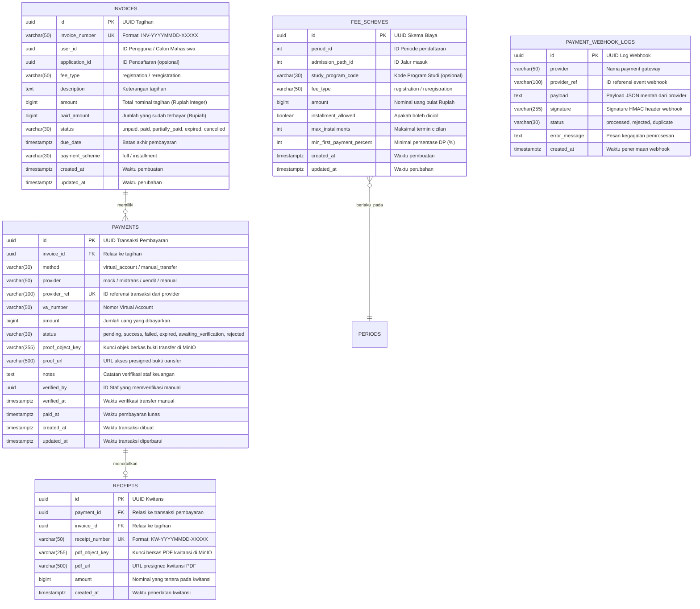

# Entity Relationship Diagram (ERD) — Finance Service

Dokumen ini memetakan relasi tabel-tabel pada basis data `pmb_finance`.

```mermaid
erDiagram
    INVOICES ||--o{ PAYMENTS : "memiliki"
    PAYMENTS ||--o| RECEIPTS : "menerbitkan"
    FEE_SCHEMES }o--|| PERIODS : "berlaku_pada"

    FEE_SCHEMES {
        uuid id PK "UUID Skema Biaya"
        int period_id "ID Periode pendaftaran"
        int admission_path_id "ID Jalur masuk"
        varchar(30) study_program_code "Kode Program Studi (opsional)"
        varchar(50) fee_type "registration / reregistration"
        bigint amount "Nominal uang bulat Rupiah"
        boolean installment_allowed "Apakah boleh dicicil"
        int max_installments "Maksimal termin cicilan"
        int min_first_payment_percent "Minimal persentase DP (%)"
        timestamptz created_at "Waktu pembuatan"
        timestamptz updated_at "Waktu perubahan"
    }

    INVOICES {
        uuid id PK "UUID Tagihan"
        varchar(50) invoice_number UK "Format: INV-YYYYMMDD-XXXXX"
        uuid user_id "ID Pengguna / Calon Mahasiswa"
        uuid application_id "ID Pendaftaran (opsional)"
        varchar(50) fee_type "registration / reregistration"
        text description "Keterangan tagihan"
        bigint amount "Total nominal tagihan (Rupiah integer)"
        bigint paid_amount "Jumlah yang sudah terbayar (Rupiah)"
        varchar(30) status "unpaid, paid, partially_paid, expired, cancelled"
        timestamptz due_date "Batas akhir pembayaran"
        varchar(30) payment_scheme "full / installment"
        timestamptz created_at "Waktu pembuatan"
        timestamptz updated_at "Waktu perubahan"
    }

    PAYMENTS {
        uuid id PK "UUID Transaksi Pembayaran"
        uuid invoice_id FK "Relasi ke tagihan"
        varchar(30) method "virtual_account / manual_transfer"
        varchar(50) provider "mock / midtrans / xendit / manual"
        varchar(100) provider_ref UK "ID referensi transaksi dari provider"
        varchar(50) va_number "Nomor Virtual Account"
        bigint amount "Jumlah uang yang dibayarkan"
        varchar(30) status "pending, success, failed, expired, awaiting_verification, rejected"
        varchar(255) proof_object_key "Kunci objek berkas bukti transfer di MinIO"
        varchar(500) proof_url "URL akses presigned bukti transfer"
        text notes "Catatan verifikasi staf keuangan"
        uuid verified_by "ID Staf yang memverifikasi manual"
        timestamptz verified_at "Waktu verifikasi transfer manual"
        timestamptz paid_at "Waktu pembayaran lunas"
        timestamptz created_at "Waktu transaksi dibuat"
        timestamptz updated_at "Waktu transaksi diperbarui"
    }

    RECEIPTS {
        uuid id PK "UUID Kwitansi"
        uuid payment_id FK "Relasi ke transaksi pembayaran"
        uuid invoice_id FK "Relasi ke tagihan"
        varchar(50) receipt_number UK "Format: KW-YYYYMMDD-XXXXX"
        varchar(255) pdf_object_key "Kunci berkas PDF kwitansi di MinIO"
        varchar(500) pdf_url "URL presigned kwitansi PDF"
        bigint amount "Nominal yang tertera pada kwitansi"
        timestamptz created_at "Waktu penerbitan kwitansi"
    }

    PAYMENT_WEBHOOK_LOGS {
        uuid id PK "UUID Log Webhook"
        varchar(50) provider "Nama payment gateway"
        varchar(100) provider_ref "ID referensi event webhook"
        text payload "Payload JSON mentah dari provider"
        varchar(255) signature "Signature HMAC header webhook"
        varchar(30) status "processed, rejected, duplicate"
        text error_message "Pesan kegagalan pemrosesan"
        timestamptz created_at "Waktu penerimaan webhook"
    }
```
