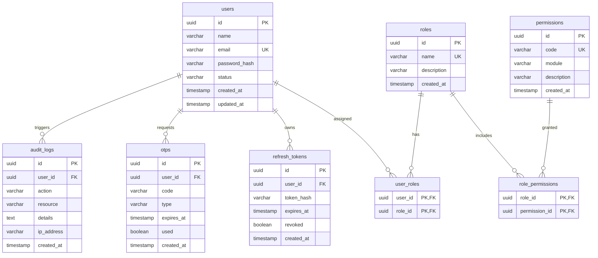

# Entity Relationship Diagram (ERD): Database `pmb_auth` (CR-011)

Diagram relasi entitas untuk basis data `pmb_auth` yang dikelola secara eksklusif oleh layanan `gateway`.

```mermaid
erDiagram
    users {
        uuid id PK
        varchar name
        varchar email UK
        varchar password_hash
        varchar status
        timestamp created_at
        timestamp updated_at
    }

    roles {
        uuid id PK
        varchar name UK
        varchar description
        timestamp created_at
    }

    permissions {
        uuid id PK
        varchar code UK
        varchar module
        varchar description
        timestamp created_at
    }

    user_roles {
        uuid user_id PK, FK
        uuid role_id PK, FK
    }

    role_permissions {
        uuid role_id PK, FK
        uuid permission_id PK, FK
    }

    refresh_tokens {
        uuid id PK
        uuid user_id FK
        varchar token_hash
        timestamp expires_at
        boolean revoked
        timestamp created_at
    }

    otps {
        uuid id PK
        uuid user_id FK
        varchar code
        varchar type
        timestamp expires_at
        boolean used
        timestamp created_at
    }

    audit_logs {
        uuid id PK
        uuid user_id FK
        varchar action
        varchar resource
        text details
        varchar ip_address
        timestamp created_at
    }

    users ||--o{ user_roles : "assigned"
    roles ||--o{ user_roles : "has"
    roles ||--o{ role_permissions : "includes"
    permissions ||--o{ role_permissions : "granted"
    users ||--o{ refresh_tokens : "owns"
    users ||--o{ otps : "requests"
    users ||--o{ audit_logs : "triggers"
```
