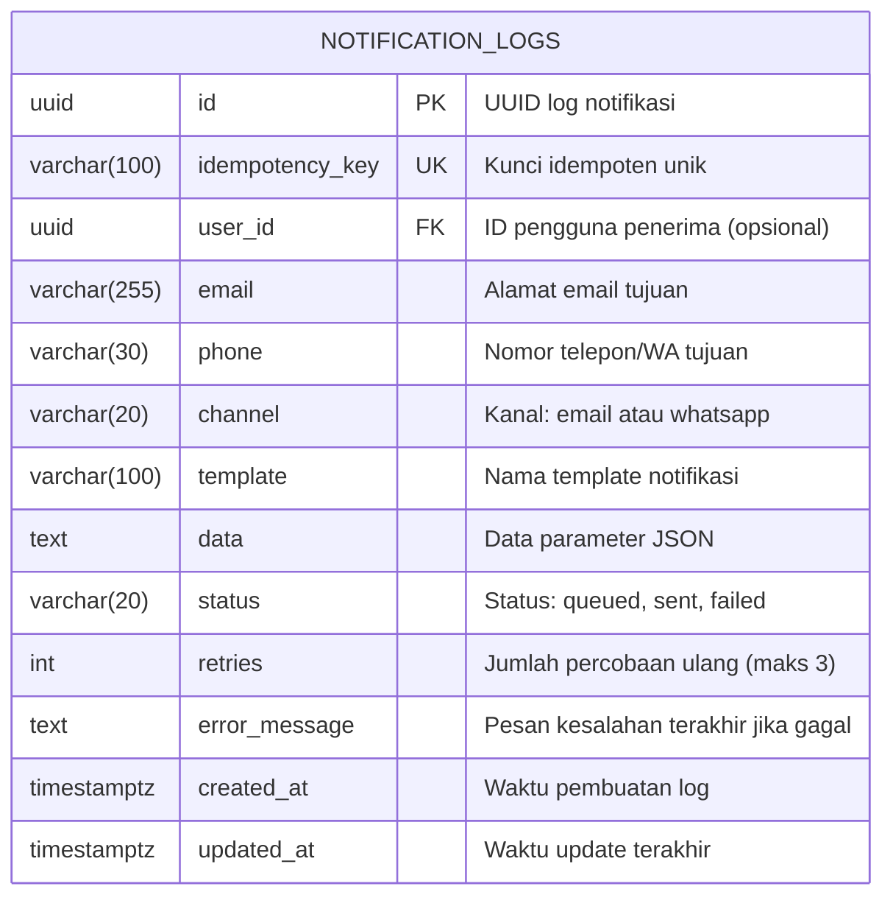

# Entity Relationship Diagram (ERD) — Notification Service

Dokumen ini memetakan skema tabel database `pmb_notification`.

```mermaid
erDiagram
    NOTIFICATION_LOGS {
        uuid id PK "UUID log notifikasi"
        varchar(100) idempotency_key UK "Kunci idempoten unik"
        uuid user_id FK "ID pengguna penerima (opsional)"
        varchar(255) email "Alamat email tujuan"
        varchar(30) phone "Nomor telepon/WA tujuan"
        varchar(20) channel "Kanal: email atau whatsapp"
        varchar(100) template "Nama template notifikasi"
        text data "Data parameter JSON"
        varchar(20) status "Status: queued, sent, failed"
        int retries "Jumlah percobaan ulang (maks 3)"
        text error_message "Pesan kesalahan terakhir jika gagal"
        timestamptz created_at "Waktu pembuatan log"
        timestamptz updated_at "Waktu update terakhir"
    }
```
