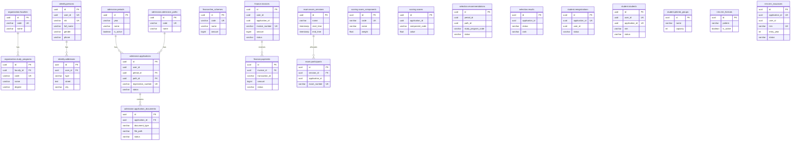

# Entity Relationship Diagram (ERD): Database `pmb_app` (CR-011)

Diagram relasi entitas untuk basis data aplikasi tunggal `pmb_app` dengan 10 skema terisolasi (*Schema Isolation*).

```mermaid
erDiagram
    %% Schema: organization
    "organization.faculties" {
        uuid id PK
        varchar code UK
        varchar name
    }
    "organization.study_programs" {
        uuid id PK
        uuid faculty_id FK
        varchar code UK
        varchar name
        varchar degree
    }

    %% Schema: identity
    "identity.persons" {
        uuid id PK
        uuid user_id UK
        varchar nik UK
        varchar full_name
        varchar gender
        varchar phone
    }
    "identity.addresses" {
        uuid id PK
        uuid user_id FK
        varchar type
        text street
        varchar city
    }

    %% Schema: admission
    "admission.periods" {
        uuid id PK
        varchar year
        varchar name
        boolean is_active
    }
    "admission.admission_paths" {
        uuid id PK
        varchar code UK
        varchar name
    }
    "admission.applications" {
        uuid id PK
        uuid user_id
        uuid period_id FK
        uuid path_id FK
        varchar registration_number UK
        varchar status
    }
    "admission.application_documents" {
        uuid id PK
        uuid application_id FK
        varchar document_type
        varchar file_path
        varchar status
    }

    %% Schema: finance
    "finance.fee_schemes" {
        uuid id PK
        varchar code UK
        varchar name
        bigint amount
    }
    "finance.invoices" {
        uuid id PK
        uuid user_id
        uuid application_id
        varchar invoice_number UK
        bigint amount
        varchar status
    }
    "finance.payments" {
        uuid id PK
        uuid invoice_id FK
        varchar transaction_id
        bigint amount
        varchar status
    }

    %% Schema: exam
    "exam.exam_sessions" {
        uuid id PK
        varchar name
        timestamp start_time
        timestamp end_time
    }
    "exam.participants" {
        uuid id PK
        uuid session_id FK
        uuid application_id
        varchar exam_number UK
    }

    %% Schema: scoring
    "scoring.score_components" {
        uuid id PK
        varchar code UK
        varchar name
        float weight
    }
    "scoring.scores" {
        uuid id PK
        uuid application_id
        varchar component_code
        float value
    }

    %% Schema: selection
    "selection.recommendations" {
        uuid id PK
        uuid period_id
        uuid path_id
        varchar study_program_code
        varchar status
    }
    "selection.results" {
        uuid id PK
        uuid application_id
        varchar status
        varchar rank
    }

    %% Schema: student
    "student.reregistrations" {
        uuid id PK
        uuid application_id UK
        uuid user_id
        varchar status
    }
    "student.students" {
        uuid id PK
        uuid user_id UK
        uuid application_id UK
        varchar nim
        varchar status
    }
    "student.pkkmb_groups" {
        uuid id PK
        varchar name
        int capacity
    }

    %% Schema: nim
    "nim.nim_formats" {
        uuid id PK
        varchar pattern
        boolean is_active
    }
    "nim.nim_issuances" {
        uuid id PK
        uuid application_id UK
        uuid user_id
        varchar nim UK
        int entry_year
        varchar status
    }

    "organization.faculties" ||--o{ "organization.study_programs" : "has"
    "identity.persons" ||--o{ "identity.addresses" : "has"
    "admission.periods" ||--o{ "admission.applications" : "has"
    "admission.admission_paths" ||--o{ "admission.applications" : "has"
    "admission.applications" ||--o{ "admission.application_documents" : "contains"
    "finance.invoices" ||--o{ "finance.payments" : "receives"
    "exam.exam_sessions" ||--o{ "exam.participants" : "allocates"
```
