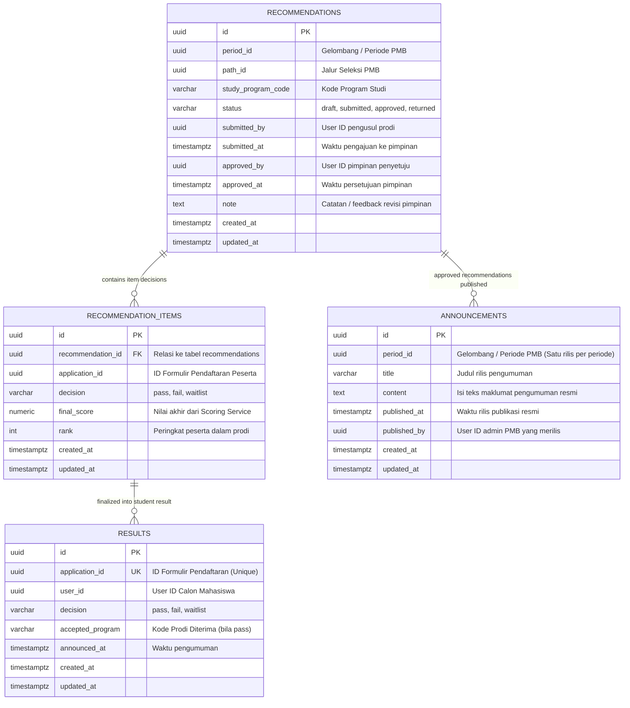

# Entity Relationship Diagram — Selection Service (pmb_selection)

Dokumen ini mendokumentasikan skema relasional tabel pada basis data `pmb_selection`.

```mermaid
erDiagram
    RECOMMENDATIONS {
        uuid id PK
        uuid period_id "Gelombang / Periode PMB"
        uuid path_id "Jalur Seleksi PMB"
        varchar study_program_code "Kode Program Studi"
        varchar status "draft, submitted, approved, returned"
        uuid submitted_by "User ID pengusul prodi"
        timestamptz submitted_at "Waktu pengajuan ke pimpinan"
        uuid approved_by "User ID pimpinan penyetuju"
        timestamptz approved_at "Waktu persetujuan pimpinan"
        text note "Catatan / feedback revisi pimpinan"
        timestamptz created_at
        timestamptz updated_at
    }

    RECOMMENDATION_ITEMS {
        uuid id PK
        uuid recommendation_id FK "Relasi ke tabel recommendations"
        uuid application_id "ID Formulir Pendaftaran Peserta"
        varchar decision "pass, fail, waitlist"
        numeric final_score "Nilai akhir dari Scoring Service"
        int rank "Peringkat peserta dalam prodi"
        timestamptz created_at
        timestamptz updated_at
    }

    ANNOUNCEMENTS {
        uuid id PK
        uuid period_id "Gelombang / Periode PMB (Satu rilis per periode)"
        varchar title "Judul rilis pengumuman"
        text content "Isi teks maklumat pengumuman resmi"
        timestamptz published_at "Waktu rilis publikasi resmi"
        uuid published_by "User ID admin PMB yang merilis"
        timestamptz created_at
        timestamptz updated_at
    }

    RESULTS {
        uuid id PK
        uuid application_id UK "ID Formulir Pendaftaran (Unique)"
        uuid user_id "User ID Calon Mahasiswa"
        varchar decision "pass, fail, waitlist"
        varchar accepted_program "Kode Prodi Diterima (bila pass)"
        timestamptz announced_at "Waktu pengumuman"
        timestamptz created_at
        timestamptz updated_at
    }

    RECOMMENDATIONS ||--o{ RECOMMENDATION_ITEMS : "contains item decisions"
    RECOMMENDATIONS ||--o{ ANNOUNCEMENTS : "approved recommendations published"
    RECOMMENDATION_ITEMS ||--o{ RESULTS : "finalized into student result"
```
