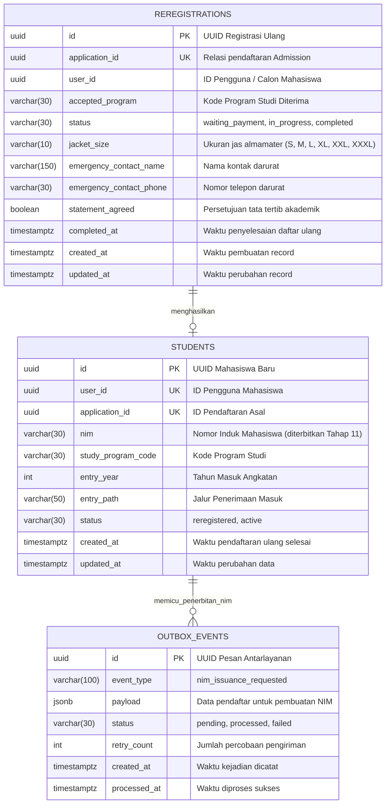

# Entity Relationship Diagram (ERD) — Student Service

Dokumen ini memetakan relasi tabel-tabel pada basis data `pmb_student`.

```mermaid
erDiagram
    REREGISTRATIONS ||--o| STUDENTS : "menghasilkan"
    STUDENTS ||--o{ OUTBOX_EVENTS : "memicu_penerbitan_nim"

    REREGISTRATIONS {
        uuid id PK "UUID Registrasi Ulang"
        uuid application_id UK "Relasi pendaftaran Admission"
        uuid user_id "ID Pengguna / Calon Mahasiswa"
        varchar(30) accepted_program "Kode Program Studi Diterima"
        varchar(30) status "waiting_payment, in_progress, completed"
        varchar(10) jacket_size "Ukuran jas almamater (S, M, L, XL, XXL, XXXL)"
        varchar(150) emergency_contact_name "Nama kontak darurat"
        varchar(30) emergency_contact_phone "Nomor telepon darurat"
        boolean statement_agreed "Persetujuan tata tertib akademik"
        timestamptz completed_at "Waktu penyelesaian daftar ulang"
        timestamptz created_at "Waktu pembuatan record"
        timestamptz updated_at "Waktu perubahan record"
    }

    STUDENTS {
        uuid id PK "UUID Mahasiswa Baru"
        uuid user_id UK "ID Pengguna Mahasiswa"
        uuid application_id UK "ID Pendaftaran Asal"
        varchar(30) nim "Nomor Induk Mahasiswa (diterbitkan Tahap 11)"
        varchar(30) study_program_code "Kode Program Studi"
        int entry_year "Tahun Masuk Angkatan"
        varchar(50) entry_path "Jalur Penerimaan Masuk"
        varchar(30) status "reregistered, active"
        timestamptz created_at "Waktu pendaftaran ulang selesai"
        timestamptz updated_at "Waktu perubahan data"
    }

    OUTBOX_EVENTS {
        uuid id PK "UUID Pesan Antarlayanan"
        varchar(100) event_type "nim_issuance_requested"
        jsonb payload "Data pendaftar untuk pembuatan NIM"
        varchar(30) status "pending, processed, failed"
        int retry_count "Jumlah percobaan pengiriman"
        timestamptz created_at "Waktu kejadian dicatat"
        timestamptz processed_at "Waktu diproses sukses"
    }
```
